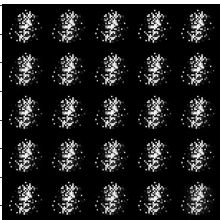
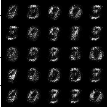
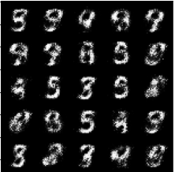
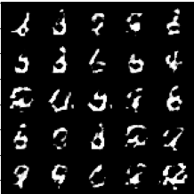
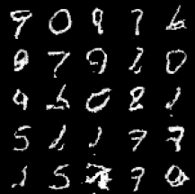
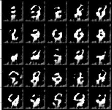
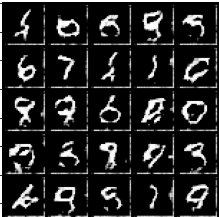
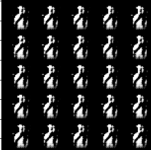
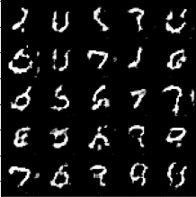

# GAN Normalization Evolution
This repo demonstrates the effect of different normalization techniques on training GANs on the MNIST dataset.

By running the notebook on Kaggle Kernels or Google Colab with GPU the following results should be reproduced without 
installing any packages.

All models were trained for 25 epochs and noise dimensionality of Z=64.

<ul>
    <li>
    
 Linear Layers Without BatchNorm (didn't converge after 25 epochs)

    
    </li>
    <li>
    
 Linear Layers + 1D BatchNorm

    
    
    </li>
    <li>
    
 CNN + 2D BatchNorm

    
    
    </li>
    <li>
    
 CNN + Pytorch's spectral_norm

    
    
    </li>
    <li>
    
 CNN + Implemented spectral norm

    
    
    </li>
</ul>

### References
- [Original GAN Paper](https://arxiv.org/abs/1406.2661)
- [DCGAN Paper](https://arxiv.org/pdf/1511.06434)
- [Spectral Normalization Paper](https://arxiv.org/abs/1802.05957)
- [Coursera GAN Specialization](https://github.com/amanchadha/coursera-gan-specialization)
- [Spectral Norm Reference Implementation](https://github.com/christiancosgrove/pytorch-spectral-normalization-gan)
